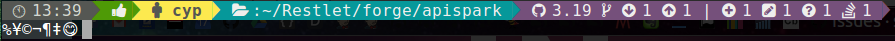

# Shell prompt

Generate and customize a beautiful segmented prompt in your terminal.

Ex:


## Installation

This theme uses Font Awesome and Powerline fonts. Install them before anything else. To install a font, copy it in your ~/.fonts

1. _Powerline font:_ [Download here](https://github.com/powerline/powerline/raw/develop/font/PowerlineSymbols.otf)
2. _Font awesome_: [Download here](https://github.com/FortAwesome/Font-Awesome/raw/master/fonts/fontawesome-webfont.ttf)

Alternatively, you can use fonts from <https://www.nerdfonts.com/>.

Uses the method `buildPrompt` from `buildPrompt.sh` to build a beautiful shell prompt in file `ps1` from configuration file `ps1_config`.

## Configure the segments

The file `ps1_config` describes the segments of the prompt in CSV. Each line corresponds to a segment. The configurable fields are:

1. _Font style_: choose from _normal, bold, dim & hidden_
2. _Font color:_ choose from colors below
3. _Background color:_ choose from colors below
4. _Content:_ the content of the segment
5. _Condition:_ the conditions that trigger the output of the segment. The first segment _MUST_ be displayed at all times ! (its condition must be `true`)

### Available colors

* normal
* black
* red
* green
* yellow
* blue
* magenta
* cyan
* lightgrey
* darkgrey
* lightred
* lightgreen
* lightyellow
* lightblue
* lightmagenta
* lightcyan
* white

## Generate the PS1

Build the prompt by running `buildPrompt` from the file `buildPrompt.sh` then add the following lines in your bashrc:

```bash
export BASH_PROMPT_PATH="/path/to/ps1/file"

# Last return code (used in segments 2 & 3 of the example)
RET=$?
BASH_PROMPT=$(cat "$BASH_PROMPT_PATH/ps1")
[ -n "$PS1" ] && PS1="$BASH_PROMPT"
```
